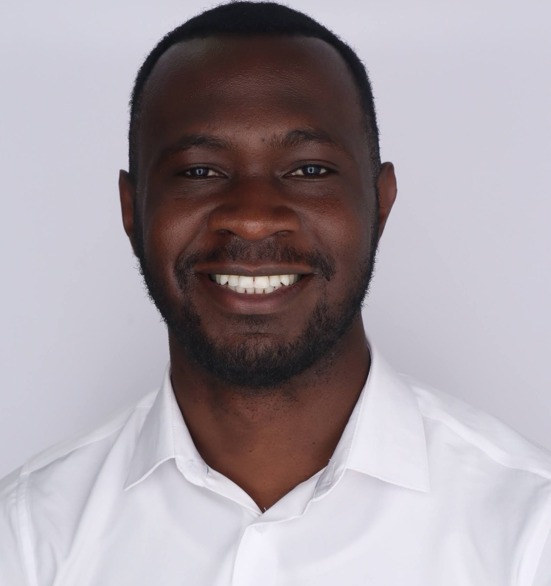

  
  

    <h1 style="margin-bottom: 0;">Edison M. Murairi</h1>
    
<a href="https://github.com/">GitHub</a> · <a href="https://linkedin.com/">LinkedIn</a>

  

---

## About me

I am currently a Quantum Theory Research Associate at the Fermi National Accelerator Laboratory (Fermilab) where I conduct research in developing and benchmarking algorithms for qudit quantum computers. I received my PhD under Prof. Andrei Alexandru at George Washington University, where I developed algorithms to simulate gauge theories on quantum computers.

---

## Publications

- *Synthesis of Qutrit Circuits over the Clifford + R Gates*  
- *Highly-Efficient Quantum Fourier Transformations for Some Non-Abelian Groups*  
- *Primitive Quantum Gates for a SU(3) Discrete Subgroup: Σ(36 × 3)*  
- *Fuzzy Gauge Theory for Quantum Computers*  
- *Reducing Circuit Depth with Qubitwise Diagonalization*  
- *How Many Quantum Gates do Gauge Theories Require?*  

---

## Selected Talks

- *Synthesis of Qutrit Circuits over the Clifford + R Gates* — APS March, 2025  
- *Number Theoretic Aspects of Fault-Tolerant Gate Synthesis* — SQMS Center at Fermilab  
- *Simulating Gauge Theories on Quantum Computers* — NYU Abu Dhabi Quantum Systems Center  
- *Reducing Circuit Depth with Qubitwise Diagonalization* — University of Maryland Quantum Seminar  
- *Fault-Tolerant Simulations of Gauge Theories with Finite SU(3) Subgroups* — GWU Nuclear Physics Seminar  

---

## Awards

- Parke Award for Excellence in Theoretical Physics — May 2023  
- NYU Tandon School of Engineering Fellowship  
- NYU Abu Dhabi Research Grants  

---

## Education

**George Washington University (GWU)**  
_Ph.D. in Physics, M.Sc. in Physics & Graduate Certificate in Data Science_  
**GPA:** 3.95 / 4.00  
**Thesis:** *Simulating Gauge Theories on Quantum Computers*  

**Relevant Coursework:**  
Quantum Computing, Quantum Chromodynamics, Advanced Quantum Mechanics, Advanced Mathematical Methods, Computational Methods for Theoretical Physics, Deep Learning, Time Series Models and Analysis, Data Mining

---

